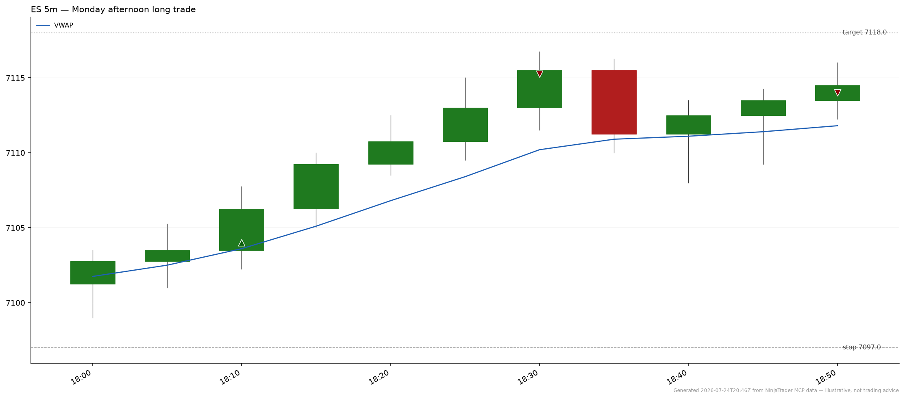

# NinjaTrader MCP skills

Agent Skills that teach an AI coding assistant such as Claude Code, Codex, or Cursor how to trade futures through the NinjaTrader MCP server. The skills cover position sizing, market structure, live position health, trade review, and alerting.

Full documentation lives at [`docs.ninjatrader.com/mcp`](https://docs.ninjatrader.com/mcp).



> [!IMPORTANT]
> This beta connects to the demo server only, so nothing here reaches a live account. The skills propose orders and never submit them, and you approve every payload. See [Safety and disclosures](https://docs.ninjatrader.com/mcp/safety).

## Skills

| Skill | What it does |
|---|---|
| [`pretrade-risk`](skills/pretrade-risk/SKILL.md) | Sizes a trade from risk-per-trade, stop distance, and contract specs, then proposes an OCO bracket. |
| [`position-watchdog`](skills/position-watchdog/SKILL.md) | Reports live health of open positions: P&L, distance to stop, margin use, and guardrail flags. |
| [`scale-manager`](skills/scale-manager/SKILL.md) | Scales into or out of a position, and builds ladder and stop-move payloads for you to approve. |
| [`market-context`](skills/market-context/SKILL.md) | Computes VWAP, market profile, ATR, realized volatility, and cumulative delta. |
| [`contract-intel`](skills/contract-intel/SKILL.md) | Resolves a bare product code to the front-month contract, and classifies rollover status. |
| [`correlation-hedge`](skills/correlation-hedge/SKILL.md) | Computes correlation and regression beta between two symbols, and sizes a hedge. |
| [`event-watch`](skills/event-watch/SKILL.md) | Filters the economic calendar to your positions, and adds historical reaction-size context. |
| [`alerts-composer`](skills/alerts-composer/SKILL.md) | Translates alert intent into a validated Tradovate alert expression. |
| [`risk-coach`](skills/risk-coach/SKILL.md) | Surfaces behavioral context from recent fills: revenge trading, loss streaks, and size drift. |
| [`trade-journal`](skills/trade-journal/SKILL.md) | Descriptive analysis of closed trades: transaction-cost analysis, streaks, and hold times. |
| [`trade-replay`](skills/trade-replay/SKILL.md) | Reconstructs one closed trade, with MFE, MAE, and what-if scenarios. |
| [`trade-debrief`](skills/trade-debrief/SKILL.md) | Educational session review across seven coaching prompt templates. |
| [`chart-render`](skills/chart-render/SKILL.md) | Renders candlestick, volume-profile, and equity-curve charts as PNG files. |

Each skill's `SKILL.md` documents its trigger phrases, the MCP tools it calls, and its bundled scripts. For a guided tour, see [Trading Skills](https://docs.ninjatrader.com/mcp/skills) and [Workflows](https://docs.ninjatrader.com/mcp/skills-workflows).

## Installation

### Claude Code

```
/plugin marketplace add NT-NinjaTrader/mcp-skills
/plugin install ninjatrader@mcp-skills
```

The plugin bundles the MCP server connection, so authorize it on first use. Confirm with `/plugin list`.

### Codex

```
codex plugin marketplace add NT-NinjaTrader/mcp-skills
codex plugin add ninjatrader@mcp-skills
codex mcp login ninjatrader-demo
```

### Skills CLI

```bash
npx skills add NT-NinjaTrader/mcp-skills
```

> [!NOTE]
> The skills CLI installs the skills only, and it doesn't register the MCP server. Register it separately:
> ```bash
> claude mcp add --transport http ninjatrader-demo https://mcp-demo.tradovateapi.com/mcp
> ```
> The first tool call opens the OAuth flow. Full instructions for every client, including Claude Desktop and ChatGPT, are in [Connect Your AI Agent](https://docs.ninjatrader.com/mcp/connect).

### Cursor

The marketplace listing awaits review. Meanwhile, add the server from this repo's [`mcp.json`](mcp.json) and install the skills with the [Skills CLI](#skills-cli).

## Prerequisites

- A Tradovate or NinjaTrader account with demo access.
- Python 3.10+, used by the analytics scripts the skills run.
- `matplotlib`, only for `chart-render`. The script declares it inline, so `uv run` installs it for you.

## Troubleshooting

| Symptom | Fix |
|---|---|
| OAuth sign-in fails | Check the URL matches `https://mcp-demo.tradovateapi.com/mcp` exactly. If the popup closes early, retry, because OAuth state times out. |
| A skill doesn't trigger | Name it explicitly, as in `"use pretrade-risk to size 4 ES"`. Then open an issue with your exact phrasing, which helps tune the triggers. |
| An alert never fired | Confirm it's active and not expired with `list_alerts`. Validate the expression with `alerts-composer` before submitting. |
| A chart doesn't render | Run the script with `uv run`, which installs `matplotlib`. If the output path isn't writable, pick another. |
| Server unreachable | Tool calls return errors and the skill says so. Check your connection, then the endpoint. |
| Rate limiting | The server enforces the same per-user limits as the Tradovate API. The skills back off and retry. |

More at [Troubleshooting](https://docs.ninjatrader.com/mcp/troubleshooting).

## Documentation

| Page | Covers |
|---|---|
| [Overview](https://docs.ninjatrader.com/mcp) | What the MCP server is, and how the pieces fit. |
| [Connect Your AI Agent](https://docs.ninjatrader.com/mcp/connect) | Setup for Claude Code, Claude Desktop, ChatGPT, Codex, and Cursor. |
| [Authentication & Access](https://docs.ninjatrader.com/mcp/authentication) | OAuth scopes and session mechanics. |
| [Safety & Disclosures](https://docs.ninjatrader.com/mcp/safety) | The approval model, risk controls, and what you stay responsible for. |
| [Pre-Trade Risk](https://docs.ninjatrader.com/mcp/pre-trade-risk) | The server-side limits that bound what an agent can propose. |
| [Tools](https://docs.ninjatrader.com/mcp/tools) | Every tool the server exposes. |
| [Resources](https://docs.ninjatrader.com/mcp/resources) | Account and market-data resources. |
| [Skill Reference](https://docs.ninjatrader.com/mcp/skills-reference) | Per-skill reference, generated from this repo. |

## Feedback

Open an issue from a [template](https://github.com/NT-NinjaTrader/mcp-skills/issues/new/choose). A trigger phrase that routed to the wrong skill is the most useful report, so include the exact wording.

> [!WARNING]
> Never post an account number, an order ID, or fill detail in a public issue. For account, login, funding, or order help, contact [NinjaTrader support](https://ninjatrader.com/support/) instead, because a GitHub issue can't reach your account.
